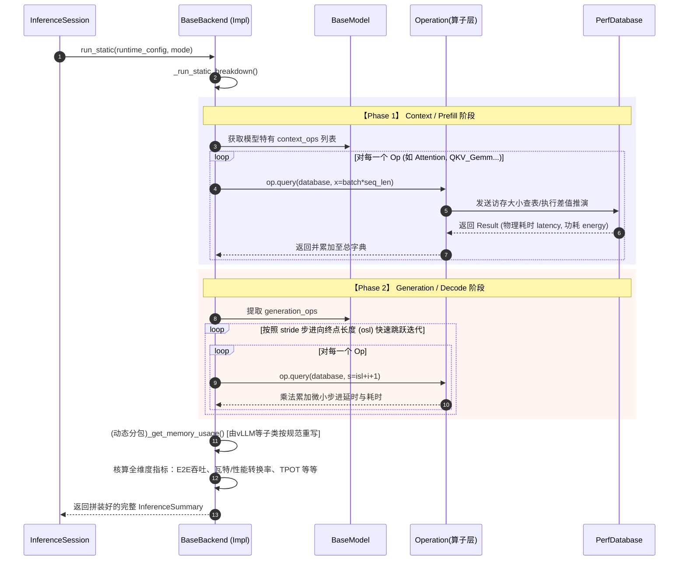

# Base Backend 解析总结

**快速概括**：`base_backend.py` 中的 `BaseBackend` 是 aiconfigurator 项目中所有真实推理框架（如 vLLM、SGLang、TRT-LLM 等）在仿真层面的**骨架基类（Abstract Base Class）**。它定义并实现了算力评估中的“微观耗时按序累计”标准计算流水线，同时规范了所有后续推理后端在宏观并发调度和显存评估上的约束接口。

## 1. 主要功能概括

`BaseBackend` 作为下级执行的核心枢纽，主要肩负着以下核心职能：

*   **算子级时空累加引擎（Micro-Phase Evaluation）**：内部实现了高度完备的静态推演流水线（`run_static` 及其前置方法），通过解耦出 Context（Prefill阶段）和 Generation（Decode阶段），逐个轮询 Model 中的网络算子序列并向 Database 索要理论性能数据，将单层的小数级耗时精准累加为宏观可见的 TTFT 和 TPOT。
*   **抽象化特征抹平（Framework Abstraction）**：作为虚基类，它封装并统一了底层不同软件框架的评估入口。无论是哪个具体实现（`vllm_backend`, `sglang_backend`），对外暴露的一律是标准规范的计算特征，抹平了引擎之间的通讯、执行和排队粒度隔阂。
*   **资源账本与物理聚合（Resource & Metrics Aggregation）**：除了单纯加和时间以外，还能自动推算出包括 `e2e_power_avg` (平均瓦数功耗)、`tokens_s_gpu` (单卡吞吐) 在内的庞大评价矩阵包装（输出为 DataFrame）。同时预留显存账本 `_get_memory_usage` 由各个子引擎填写。

## 2. 细节内容深度解析

基类自身承载了一段推理从头至尾在仿真环节所必须的循环迭代计算代码，以下是对其关键设计模块的详细剖析：

### 2.1 阶段时延分解评估引擎 (Phase Evaluation)

为精准还原物理机执行全流程，基类拆分并实现：
*   **`_run_context_phase`**:
    *   **输入**：需要模型结构 `model`、硬件载底 `database`、负荷状况 `isl` (实际提示词长) 及 `prefix` (命中缓存长)。
    *   **输出**：返回包含每一个算子名称字典形式时延、功耗矩阵 `tuple[dict[latency], dict[energy], dict[source]]`。
    *   **逻辑**：遍历 `model.context_ops`，并向每一个算子调用 `op.query()` 算力寻问过程。如果算子是类似非日志的矩阵（非 `logits_gemm`），则依据计算法则按乘数级别累计批处理特征请求硬件。
*   **`_run_generation_phase`**:
    *   **输入**：包含步长限制 `stride` 以及最终生成边界 `osl` 变量。
    *   **输出**：格式与 Context 阶段一致字典结果包。
    *   **逻辑**：生成段耗时并非匀速！其由于 KV Cache 的推移而增长。因此基类设计了步进（Stride）抽样计算机制：即不再一轮轮傻算到最后一颗 token，而是以 `stride` 为间隔点取样并乘以 `repeat_count` 加速推断以提高代码搜索率。
*   **`_run_static_breakdown`**:
    这是一个整合上述两个方法的内部中继枢纽。它根据上层传达的 `mode` (是 prefill 纯测还是全链路)，选择对应的 phase 并直接乘上误差抵消校准缩放常数 (`latency_correction_scale`)。

### 2.2 仿真指标核算收口 (Simulation Aggregation)

*   **`run_static`**:
    *   **逻辑**：核心“胶水函数”。使用上述的 breakdown 得出微观数据相加的宏观数据（延迟与功耗和），同时反向调用抽象的 `_get_memory_usage`。
    *   **数据清洗转换**：将各类统计通过规范化手段（包括考虑到模型维度的流水并行 PP 和多头并发机制等因素进行 `seq_s / model.config.tp_size` GPU 除解切割）聚合为最长多达 30 多个字段的核心报告格式 DataFrame 表并包装在 `InferenceSummary` 中发还给 `InferenceSession`。

### 2.3 子类衍生与规约 (Abstract Implementations)

BaseBackend 使用 Python `@abstractmethod` 装饰器，强烈强制下游所有具体的框架继承类实现三个接口：
*   **`run_agg`**: 对应聚合推演的核心复杂态（因涉及到引擎专有的 Chunked Prefill 等特性）；
*   **`find_best_agg_result_under_constraints`**: 寻找资源限制下最佳配置逻辑，同上需各回退引擎处理本身的机制特征。
*   **`_get_memory_usage`**: 由于 vLLM、SGLang 框架在 KV Cache 储备（如 PagedAttention 管理内存碎片、RadixAttention 树）的原理截然不同，该计算方法需交给各自独立的 Backend 自己依据自身设计填写重写。

### 2.4 内置工具及生态

*   **`_get_ctx_tokens_list_for_agg_sweep`**: 这是为一个特定的辅助性搜索池。它专门为了 `run_agg` 使用。在评估具有 Chunked Prefill 或大容量上下文特性的环境池时，提前帮助下发合理的扫描采样步长列表以加速引擎枚举效率。

---

## 3. 核心机制时序流转图 (Sequence Diagram)

以下图表体现了上游 `Session` 调用 `run_static` 后，`BaseBackend` 如何穿针引线向 `Model`, `Ops` 以及底层硬件性能库 `PerfDatabase` 进行计算量与查表的穿插交涉过程：

## 4. 上层调用与生态位全景

从 aiconfigurator 生态体系看，`BaseBackend` 处于“计算核心”的中间层：

1. **上游调用链 (Upstream)**：
   唯一的调用者是 `InferenceSession` 及 `DisaggInferenceSession`（在文件内部以及上级搜索 API 等）。Session 就是个只会派发清单的老板，而 `BaseBackend` 是包揽具体工作的车间总监。
2. **下游依赖组件 (Downstream Dependencies)**：
   向下直接交互 `BaseModel`（获取结构形状、索要需要循环计算的 Ops 列表）以及 `PerfDatabase`（作为基准标尺提供具体的浮点运算真实时间）。
3. **平级多台衍生 (Sibling Extensions)**：
   存在一个叫做 `factory.py` 的文件基于它孕育衍生出专门面对各个物理引擎的仿真代理，如 `vllm_backend.py`, `sglang_backend.py`, `trtllm_backend.py`。每个针对框架独特的调度气泡损耗和 PagedAttention 显存计算提供特殊的修正方法覆写（Override）。
