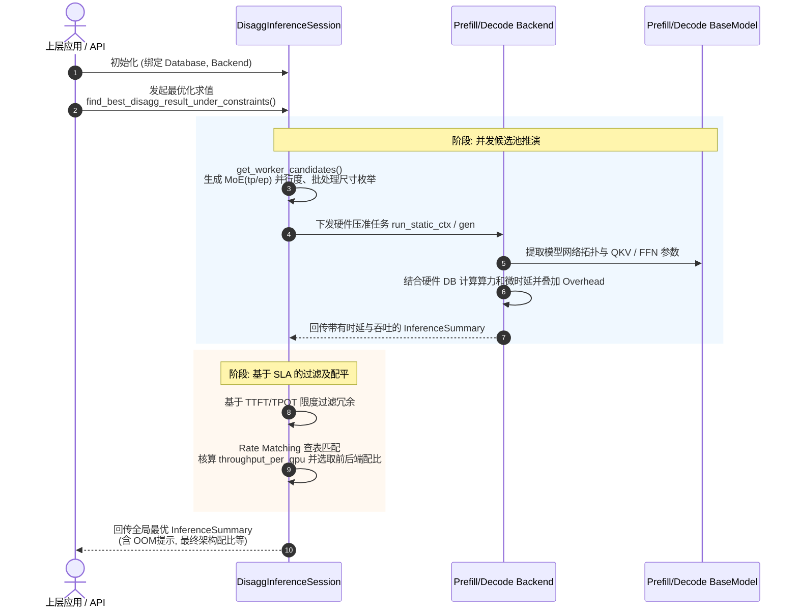

# Inference Session 解析总结

**快速概括**：`inference_session.py` 是 aiconfigurator (aic) 项目 SDK 层的核心控制与调度总线，通过对模型（Model）、硬件参数数据库（PerfDatabase）和推理后端（Backend）三者进行解耦并重新组装封装，提供统一的同构与分离式宏观端到端推理性能评估和最优化方案检索接口。

## 1. 主要功能概括

`inference_session.py` 中的核心组件主要分为处理同构部署架构的 `InferenceSession` 以及处理分离式架构的 `DisaggInferenceSession`。该组件充当门面模式（Facade Pattern）的协调者，将下层具体的评估逻辑全部委托给选定的 `Backend`，而自身专注于提供流程编排和外围调度：

*   **实体解耦与组装 (Decoupling & Orchestration)**：通过初始化时绑定 `Model`、`PerfDatabase` 和 `Backend` 对象（对于分离式架构则分别维护 Prefill 和 Decode 两套实例），实现将模型算子拓扑、硬件微观时延和后端推理框架宏观通信、调度开销无缝结合。
*   **静态测算 (Static Run)**：给定具体的批处理大小（Batch Size）和各类并行度（TP, PP, DP, EP 等）静态配置，计算端到端单次推理（或Prefill/Decode任一单阶段）的固定延迟与吞吐指数据。
*   **聚合扫描 (Aggregate / Search)**：遍历多种资源分配和并行度组合（`run_agg`）并过滤，以在资源或延迟 SLA（如 TTFT、TPOT 约束）下找出最佳性能部署策略。
*   **分离式速率匹配优化 (Disaggregated Rate Matching & Autoscale)**：对于 P/D 分离的场景，自动检索能够满足吞吐匹配规则的最优前后端节点配比。最新的代码还支持了面向复杂 MoE 并行（如DeepSeek系采用的 `moe_tp`, `moe_ep`）和自治伸缩（Autoscale）配比的能力。

## 2. 细节内容深度解析

本组件内部设计遵循了严格的数据驱动和约束优化机制，核心细分为以下对象及关键函数：

### 2.1 InferenceSession (同构/单集群测算)

主要用于前后端阶段耦合在同一批显卡上执行的场景。核心函数均输出经过规范化的 `InferenceSummary` 数据类包装体。
*   **`__init__(model, database, backend)`**:
    *   **解析**：绑定模型结构（算子拓扑）、硬件数据库（微观时延）与推理后端（宏观调度通信）三大底层对象，界定本次仿真评估的唯一基准物理环境。
*   **`run_static(runtime_config, mode, stride, latency_correction_scale)`**:
    *   **输入**：包含ISL/OSL等负载数据的 `runtime_config`，评估阶段 `mode` (如 `static_ctx`或`static_gen`)，外加步长参数及修正偏差常数。
    *   **输出**：单点配置下的 `InferenceSummary` （含硬件 OOM 警告、详尽 TTFT / TPOT 时延切片与总吞吐数据）。
    *   **逻辑**：自身不遍历寻找最优解，仅做单点环境透传。将其委托给 `_backend.run_static()` 执行最底层的显存水位和硬件耗时累加模拟。
*   **`run_agg(runtime_config, **kwargs)`**:
    *   **输入/输出**：接收给定的批处理限制请求流与并发资源字典，返回全局聚合 `InferenceSummary`。
    *   **逻辑**：指派后端评估特定请求流及调度参数下、整体批量并发环境中的系统吞吐上限及资源开销分布，核心处理复杂动态批处理（Dynamic Batching）的性能测算。
*   **`find_best_agg_result_under_constraints(runtime_config, **kwargs)`**:
    *   **输入**：由 kwargs 或外层指定的性能硬约束（如严格延迟上限的 SLA 阈值与资源张数限制）。
    *   **逻辑**：向上层暴露的寻优核心 API。依赖 Backend 产生大体量的并行组合枚举空间枚举表，并严格剔除突破内存与时延限度的非法方案，最终对合法解集按吞吐大小比率（或吞吐/延迟性价比）排序后推选最优配置。

### 2.2 DisaggInferenceSession (分离式测算)

针对 Prefill（计算密集型，主要受限于算力）和 Decode（访存密集型，显存占用极大）进行两阶段解耦分离评测，以求提高系统流水线总利用率。
*   **双引擎独立管理 (`__init__`)**: 初始化时按阶段持有对应的 `database` 和 `backend` 实例（共两套），以满足前后端存在机型代差（如节点算存比差异）的环境。
*   **配置退场系数 (`set_rate_matching_degradation_factors`)**: 设置 `prefill_degradation_factor` 惩罚掉微小气泡引发的理想衰减，以 `decode_degradation_factor` 防止解码阶段未充分饱和带来的过高估计。
*   **候选节点池构建 (`get_worker_candidates(..., parallel_config_list, b_list)`)**:
    *   **输入**：模型参数、多维全空间并行枚举组合表（支持全新的如 `tp, pp, dp, moe_tp, moe_ep` 5D并行下发）以及批次步长范围 `b_list`。
    *   **输出**：所有经过验证不超时、不致爆显存（Non-OOM）的单阶段组合候选项（格式统一为 `pandas.DataFrame`）。
    *   **逻辑**：嵌套扫描解空间。逐个实例化出临时单点 `InferenceSession` 验证。由于 OOM 的特性递增，遇到超显存用量则安全 break 退出同支枚举循环。
*   **定点分离评估 (`run_disagg(..., prefill_batch_size, decode_batch_size, ...)`)**:
    *   **逻辑**：给予极度精确的工作节点数、指定配比 Batch，实例化 P/D 双端分别调用 `run_static`。继而将双侧输出通过 `_get_disagg_summary_df` 合成为含有全系统视角性能开销统计的总报表。
*   **两阶段匹配核心 (`find_best_disagg_result_under_constraints(...)`)**:
    *   **输入**：前/后端允许探索的工作线程算力维度范围列表（`num_worker_list`、并行尺寸上限）、以及硬限要求如目标 TPOT / TTFT 组合和单池内显卡上限。
    *   **匹配与过滤逻辑**：首先拉起 `get_worker_candidates` 计算出前后双端的离线结果数据库。对 TTFT 不达标的直接剔除前驱候选集，依 TPOT 界限切断后段解池。
    *   **Rate Matching (容量配平)**：依据惩罚系数执行 `_match_workers` 计算。遍历前后机群的最佳组合搭配映射（强确保配补通量一致性），并在全局范围内搜索出能得到最高算力效率性价比 (`throughput_per_gpu`) 的组合配置并抛送最优推荐子集。
    *   **Autoscale 评估**: 支持跳过传统的全节点配比，仅透过纯限流或极值阈值单独向用户分别推荐实例组态的方法 `_pick_autoscale`。

#### 💡 补充注解：P/D 分离模式与 Backend 子类的交互跃迁
**在分离式（Disaggregated）架构设计下，该组件的核心调度逻辑发生了极其重要的降级与解耦，导致其与具体 `Backend` 子类的交互特性发生了根本改变：**
1. **完全舍弃 `run_agg` 混合队列**：在同构部署中，模型为了平衡计算与访存边界，必须深度依赖各个 `Backend` 子类（如 `vLLMBackend` / `SGLANGBackend`）高度定制化的 `run_agg` 接口去计算 `mix_step`、Continuous Batching 开销及队列阻断惩罚（例如 `-3` 步惩罚修正）；然而 **P/D 分离天然隔离了这一互相掣肘的机制**。
2. **退化为极简的算力匹配阶段**：`DisaggInferenceSession` 在调用 `run_disagg` 评估时，完全绕过了所有子类定制的混合队列仿真模型，**仅仅直调最基座 `BaseBackend` 级别的静态算力推演——`run_static(mode="static_ctx" / "static_gen")`**。
3. **实例化 Backend 子类的本质目的缩缩**：此时，在初始化 `DisaggInferenceSession` 时强求传入具体框架实例的实质理由仅剩下两点：
   * **依赖子类独有的显存账本机制 (`_get_memory_usage`)**：各框架显存规划截然不同（如 TRT-LLM 的静态硬预留与 SGLang 的强调度占用底噪），这是判定单节点安全水位（避免 OOM）是否被击穿的唯一法门。
   * **提供标识给数据库（`database/ops`）实现精准查表**（例如提供特定的 C++ 算子底层微时延账单）。

### 2.3 核心流转时序图 (Sequence Diagram)
下面以分离式搜索架构节点资源池的简要推演流程为例，展示 Session 的内部机制：

## 3. 上层调用与项目总体视角

基于 aiconfigurator 整体生态而言，`inference_session` 是自下而上的“控制反转（Inversion of Control）”体现，是上层各种高阶求解与服务化界面的“心脏”。以下列举它的核心上层使用方：

1. **命令行调度与报告体系 (`cli/api.py`, `cli/report_and_save.py`)**：
   用于标准命令行评估指令。`api.py` 解析命令行搜集到的模型、流量需求后，实例化 `InferenceSession` 或分离式对象，将分析得出的最优点通过 `InferenceSummary` 对象回传展示为终端表格或固化为 CSV 文件。
2. **帕累托最优搜索器 (`sdk/pareto_analysis.py`)**：
   该工具会在多维度条件约束下（如给定 GPU 总张数，或扫描不同阶段的 TTFT/TPOT 约束阈值）进行组合枚举，疯狂且密集地去查循 `find_best_xx_under_constraints()`。从而探测物理资源的纯理论计算与访存上限边界，绘制出直观的帕累托平滑前沿（Pareto Frontier）曲线表。
3. **Web 与交互可视化引擎 (`webapp/events/event_fn.py`, `estimation.py`)**：
   专门响应界面端的动态参数拖拽或调整触发。基于 Gradio 或其他 WebUI 组件拖拽交互，每次拖拽即拉起一次即抛式的 `Session` 测算任务，计算得出当前资源下的预估结果实现实时流图表刷新展示。
4. **联动衔制 Generator (脚本与制品生成器)**：
   `Session` 中探索出的、经过 SLA 严苛过滤的“最优选”（Best Configurations），其中包含具体的拓扑维度（TP/PP等）将直接传出上游主控端，最后转抛给 `generator` 模块。`generator` 会依靠模版渲染把这些数学并发参数翻译为落地使用的 K8s YAML 配置单、运行脚本参数等。这意味着 `inference_session` 是从“仿真算理”连接走向“落体部署”的直接推导人部件。
